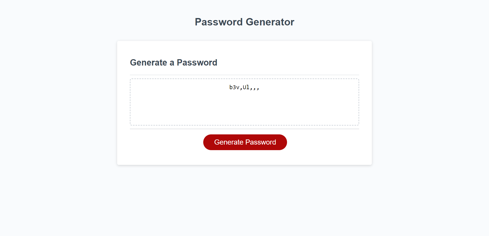

# Password Generator Starter Code

# Technology Used
HTML,CSS,JavaScript

# Technology Used
HTML
Java script
HTML

# Acceptance Criteria

Create a Password Generator That prompts the User with a series of choices for what is allowed in there random Generated password.

The password Criteria should include at least one of the following (Capitalized Letters,Lower Case Letters,Numbers, and Special characters.) and also be prompted to choose at least ONE of these options before generating a password.

Users should be prompted to determine a length to the password which should be 8 characters and more no more than 128 characters.

All prompts must be answered before a password is generated.

generated password should be displayed in an alert or written to the page.

